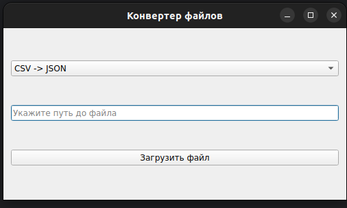

# Финальное итоговое задание №1. Конвертер из CSV в JSON.

## Содержание:
[1. Условие](#title1)  
[2. Описание решения](#title2)   
[3. Контакты](#title3)   

## <a id="title1">1. Условие:</a>
Какой-то контент

Так как Вы выпускники столь большого курса, логично, что у Вас должно быть серьезное портфолио. Как раз таки этот проект позволит Вам все ваши знания разложить по полочкам :)

Итак, к условию.

**Необходимо создать интерфейс на PyQT, который позволит конвертировать файлы CSV в JSON и наоборот.** Что важно?

* Перевод из одного формата в другой нужно делать через Pandas
* Весь UI должен быть написан на PyQT
* Взятие должно происходить только этих 2 форматов
* Для тестирования программы необходимо сгенерировать файлы двух форматов при первом запуске. Сохранение туда же, где и скрипт
* Обязательно должны быть уведомления о том, что файлы пустые
* Нельзя использовать готовые решения и выдавать их за свои
* Минимальное количество строк кода > 100, с генерацией файлов. Программы ниже этого уровня не проверяются.
* Предыдущий файл не должен затираться. 

Как все должно выглядеть? Все индивидуально, но вот шаблон.

## <a id="title2">2. Описание решения:</a>
Файл [main.py](main.py) является основным, он импортирует из [modules.py](modules.py):
* `class MyConverter`который представляет собой пользовательский интерфейс для конвертации файлов между форматами CSV и JSON, и он наследует от класса QWidget, который является базовым классом для всех виджетов в PyQt5.
* `generating_test_data` которая предназначена для создания тестовых данных и сохранения их в двух различных форматах: CSV и JSON в дерриктории `test_data`.  

### Приложение:  

* Производится выбор в какой формат необходимо конвертировать
  * В случае выбора уже существующего формата вознкнет ошибка и сообщение об этом.  
* Указывается путь до файла (полный)
  * В случае допущения ошибки в пути файла или его отсутствии возникнет ошибка и сообщение об этом.
  * В случае если файл пуст, возникнет ошибка и сообщение об этом.
* Нажимается кнопка "Загрузить файл".
  * В случае успешного выполнения, возникает сообщение указывающее какой файл и куда был сохранен.

## <a id="title4">3. Контакты:</a>
* email: [goodboy873@yandex.ru](mailto:goodboy873@yandex.ru)
* Telegram: [good_boy378](https://t.me/good_boy378)