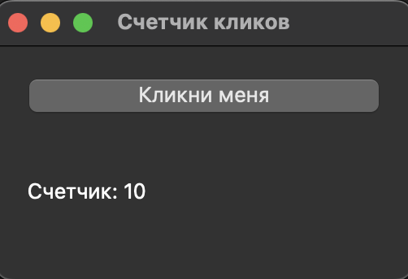

# Итоговое задание №4
Используя полученные в разделах ранее, знания, решите следующую задачу:

Создайте приложение с использованием **PyQt5**, которое включает:

1. Окно с заголовком "Счетчик кликов".
2. Кнопку с надписью "Кликни меня".
3. Метку, которая отображает количество раз, сколько пользователь нажал на кнопку.
4. Каждое нажатие на кнопку увеличивает счетчик на 1 и обновляет метку.

В качестве ответа приложите код на python.